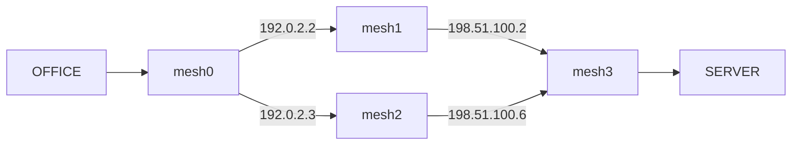

# 実configがない環境での検証ラボ

本番configの代わりに、仕様から作成した合成configと独立した期待値で検証します。合成configを実機から採取したものとは扱いません。RouterOSについては公式CHR 7.23.7をQEMUで起動し、同じconfigを投入したうえでTCPの実通信とexport再取り込みも確認しました。

## 構成と期待値

共通の例示ネットワークはOFFICE `10.44.1.0/24`、GUEST `10.44.2.0/24`、SERVER `10.44.9.0/24`。IPv6は `2001:db8:44:1::/64` → `2001:db8:44:9::/64` です。アプリは片方向の新規通信を評価し、CHRでは戻り通信も検証します。

| ディレクトリ | 主な検証 | before → after |
| --- | --- | --- |
| allied | AlliedWare PlusのVLAN filter / hardware ACL | HTTPS ALLOW → DENY、SSH・guestはDENY |
| cisco | IOS-XE、SVI、IPv4/IPv6 ACL | IPv4 HTTPS ALLOW → DENY、IPv6 HTTPSはALLOW |
| fortios | FortiOS policy、VIP `198.51.100.10:8443` → server `.20:443` | HTTPS・VIP ALLOW → DENY、SSH・guestはDENY |
| routeros | RouterOS forward、状態条件、DNAT `10.44.1.100:8443` → server `.20:443` | HTTPS・DNAT ALLOW → DENY、SSH・guestはDENY |
| vyos | VyOS 1.4形式のforward、interface条件、IPv4/IPv6 | IPv4 HTTPS ALLOW → DENY、IPv6 HTTPSはALLOW |
| ecmp | VyOS 4台、同コストの2経路 | 両方ALLOW → 一方DENYで全体PARTIAL |
| unsupported | VyOSのTCP flags条件（解析未対応） | PARTIAL → 条件を削除するとALLOW |

各 `expected.json` にSource/Destination、Protocol、Port、IP family、期待判定、NAT変換先、経路数を記載しています。解析結果から期待値を自動生成する方式ではありません。

ECMPの構成（OFFICEからSERVERへの片方向の経路を検証）:



## UIで取り込む

リポジトリルートでZIPを作成します（Python標準ライブラリだけを使用）。

```sh
python3 lab/package.py
```

`lab/bundles/` に14個のImport用ZIPと `netpolicy-validation-kit.zip` を生成します。まずConfig Importで例として `routeros-before.zip` を選び、検出プレビュー → Import。Topology / Pathで `expected.json` の条件を入力します。次に `routeros-after.zip` を別Snapshotとして取り込み、Snapshot DiffでTCP/443を比較します。

1つのSnapshotには1つの構成のZIPだけを取り込んでください。異なる構成は同じIP帯を使うため、まとめると別のネットワークになります。ECMPのZIPは4台分を含むため、そのまま1回で取り込みます。outerの `netpolicy-validation-kit.zip` は配布用で、Import対象は内側の `import/*.zip` です。

## API・画面の自動検証

Backend依存関係をインストールしたPythonで、リポジトリルートから実行します。

```sh
python lab/validate.py --native-results lab/evidence/routeros --report /tmp/netpolicy-acceptance.json
```

専用の一時SQLiteを起動前に指定し、検出プレビュー、ZIP Import、機器数・interface等の件数、Topology、Policies、Parser Debug/Warnings、Path、条件付きMatrix、変更前後Diff、バックアップ、復元後の同一経路を確認します。既存アプリのDBやSnapshotは使いません。

この検証はBackendの `python -m pytest -q` にも組み込んでいます。`frontend/integration/lab.spec.ts` は実APIを使い、7構成の実ファイルImportと変更前後の全Path条件をブラウザで確認します。既存の実APIテストがMatrix、Diff、履歴操作、バックアップ・復元の画面操作を確認します。通常のGitHub Actions CIで両方実行します。

## RouterOSネイティブ通信検証の再実行

Dockerが必要です。リポジトリルートで次を実行します。公式配布イメージを取得し、記録済みSHA-256で検証します。CHRイメージ自体はリポジトリに含めません。

```sh
docker build -t netpolicy-chr-lab:7.23.7 lab/chr
mkdir -p /tmp/netpolicy-native-results
docker run --rm --network none --name netpolicy-chr-probe \
  --cpus 2 --memory 1536m \
  -v "$PWD/lab:/lab:ro" \
  -v /tmp/netpolicy-native-results:/results \
  netpolicy-chr-lab:7.23.7
python lab/validate.py --native-results /tmp/netpolicy-native-results \
  --report /tmp/netpolicy-acceptance-native.json
```

QEMUのNICをコンテナ内のTCPソケットへ接続し、Scapyで合成端末のEthernetフレームを送受信します。Dockerの外部ネットワーク、ホストのinterface、特権モード、公開ポートは使用しません。ARM Macでもx86 CHRをTCGで実行でき、起動に時間がかかります。

許可ケースはSYN → SYN-ACK → ACKを確認。DNATでは往路の変換先IP/Portと戻りの送信元IP/Portも照合します。拒否ケースは宛先へSYNが届かず、実際のdropルールのカウンタが増加することを確認します。変更後は新しい送信元Portを使い、既存セッションの状態を引き継ぎません。

`/results` に `native.json`、変更前後の `/export`、コンソールログを出力します。exportからはVM固有のsystem idコメントだけを除外します。ログの初期パスワードは使い捨てのラボ用固定値です。VMのディスク変更はQEMUのsnapshot上に限定され、終了時に破棄します。検証コンテナも終了時に削除されます。Dockerイメージは再実行用に残ります。

`evidence/routeros/` は2026-10-05の実行で得たexportと6件の通信観測です。通常CIはこの保存済み証跡を再取り込みして検証し、VMを毎回起動するわけではありません。

## 判定の範囲と残る制約

- **dual-stackのMatrix**: IPv4/IPv6の両方を持つSegment間では、条件付きMatrixにfamily選択がないためUNKNOWNです。PathはIP familyを指定してそれぞれ検証します。Diffの通信判定も同じ制約を持ちますが、IPv4側ルールの変更自体は検出します。ここをALLOWに読み替えていません。
- **VIPのMatrixとPath**: 特定IPを指定するPathとSegment全体のMatrixは範囲が違います。VIPの一部だけが許可されるbeforeはMatrixがPARTIAL、すべて拒否されるafterはDENYを期待します。
- **実通信の対象**: ネイティブ検証はRouterOSのIPv4・単一機器・TCP/状態/NATです。他ベンダーのOS、IPv6実通信、ECMP実通信、実配線・実ハードウェア、本番configの網羅性は未検証です。
- 合成configは記載ケースの検証用であり、全機能を備えた本番導入用テンプレートではありません。VyOS等の片方向ケースから戻り通信の成功は主張しません。
- 既存SnapshotのCanonical Modelは保存時のままです。今回のParser修正を適用するには、元configを通常のConfig Importで再取り込みしてください。バックアップ復元は再解析しません。

## 今回の検証で修正した問題

1. Cisco ACLがfamilyを保持せず、IPv4にIPv6 ACLの暗黙denyを適用していた。
2. VyOS / RouterOSのinterface条件に不一致のとき、ルールと一緒にchainの既定動作まで除外していた。
3. Snapshot DiffでIPv4/IPv6の同名・同番号ルールが衝突し、状態や未対応条件等の変更も比較対象から漏れていた。
4. RouterOS 7の日時付きexportヘッダーの検出が弱く、`connection-state=\\` の直後の改行連結で不要な空白を挿入していた。状態条件が失われるとSSHを誤ってALLOWにするため、採取したexportで回帰テストを固定した。

## 仕様の参照元

合成configは以下の公式仕様を参照して作成しました。公式サンプルの完全コピーではありません。

- [Cisco IOS-XE IPv6 ACL](https://www.cisco.com/c/en/us/td/docs/routers/ios-xe/security-vpn/security-vpn/m_ip6-acls-xe.html)
- [AlliedWare Plus 5.5.5 コマンドリファレンス](https://www.allied-telesis.co.jp/support/list/awp/rel/5.5.5-2.1/613-003277_L/docs/overview-30.html)
- [FortiOS 7.2.10 VIP / port forwarding](https://docs.fortinet.com/document/fortigate/7.2.10/administration-guide/155333/virtual-ips-with-port-forwarding)
- [VyOS 1.4 IPv4 firewall](https://docs.vyos.io/en/1.4/configuration/firewall/ipv4.html)
- [VyOS 1.4 NAT44](https://docs.vyos.io/en/1.4/configuration/nat/nat44.html)
- [RouterOS NAT](https://help.mikrotik.com/docs/spaces/ROS/pages/3211299/NAT)
- [MikroTik CHR公式配布](https://mikrotik.com/download/chr)
- [CHRの仮想化要件](https://help.mikrotik.com/docs/spaces/ROS/pages/18350234/Cloud+Hosted+Router+CHR)
